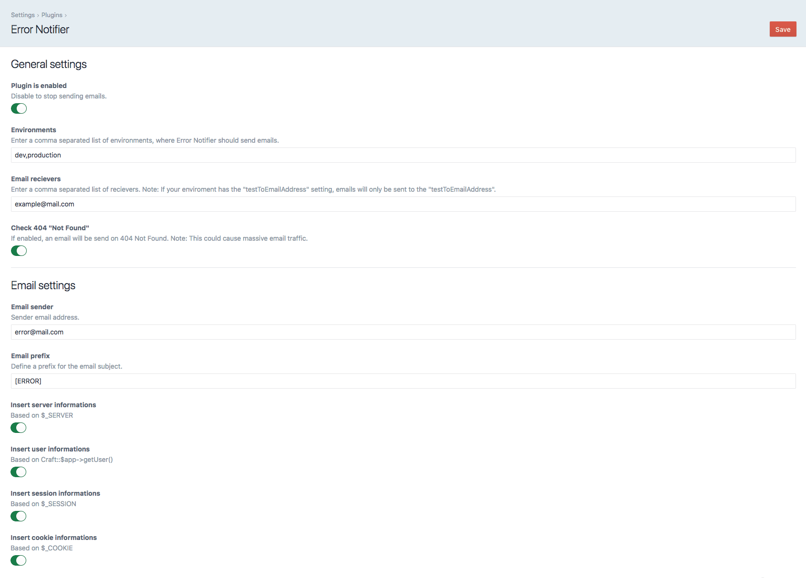
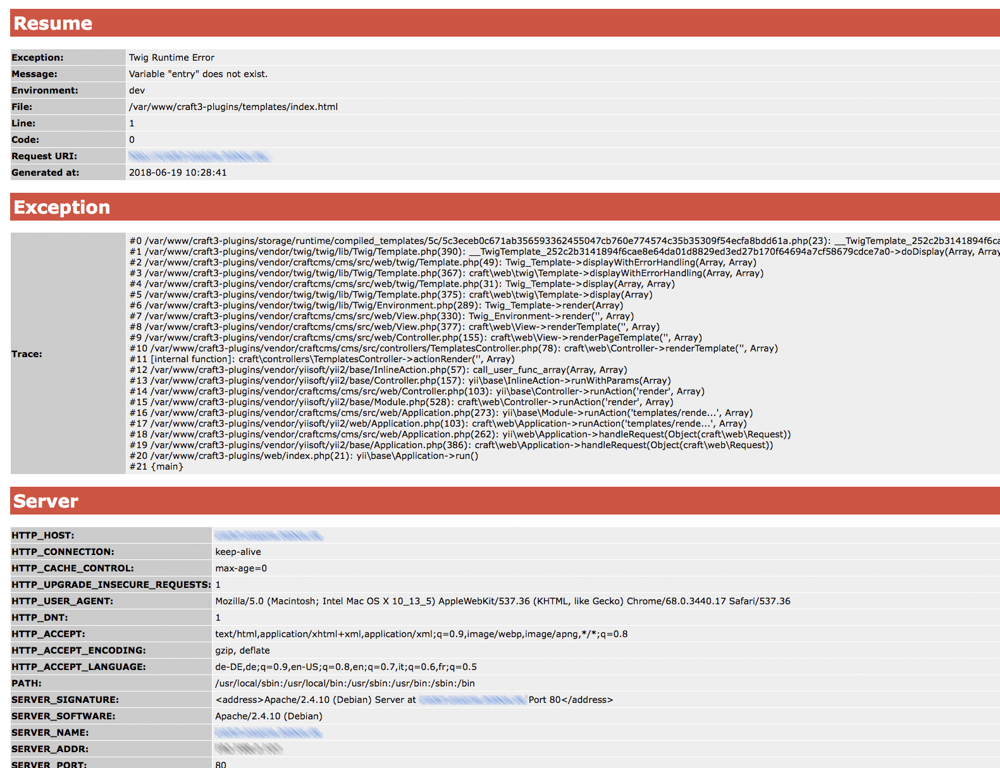

# Error Notifier for [Craft CMS 3](https://craftcms.com/)
Based on the Craft ErrorHandler, emails are sent for errors and exceptions. Take a look at the Screenshots to see all available settings and options.

## Installation
### Plugin Store (the easy way)
- In the Craft Control Panel, go to Settings -> Plugins
- Search for 'Error Notifier'
- click the "Install" button

### Composer Command Line (the manual way)
To install the plugin, follow these instructions.

1. Open your terminal and go to your Craft project:

        cd /path/to/project

2. Then tell Composer to load the plugin:

        composer require bitboxde/error-notifier

3. In the Control Panel, go to Settings → Plugins and click the “Install” button for Error Notifier.

## Screenshots
#### Settings and options

#### Email preview

### Credits
The entire dev team at [bitbox GmbH & Co. KG](https://www.bitbox.de/)